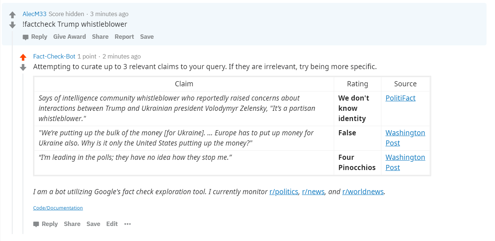

# Fact-checking bot
A reddit bot that utilizes the google [fact check tools API](https://developers.google.com/fact-check/tools/api/) to retrieve claim analysis related to an arbitrary, user-provided query. The bot will (attempt to) nicely present the most relevant claims, including the source and the source's verdict. This bot is meant to provide an efficient way to broadcast truth in response to a questionable comment. The user that calls the bot must provide the necessary keywords to find the claim if it exists - see usage below. 

# Usage
Currently, you can command the bot from these subreddits:

r/politics 
r/news 
r/worldnews 
r/Liberal 
r/Conservative (banned) 
r/Libertarian 

Use the syntax `!factcheck <query>`, where \<query> is a string of search terms used to find the desired fact-checks. Thus, you should condense a comment or submission that you wish to validate into a string that you think will most likely return the desired claim. 

Example usage and response:

# Important Notes

Google's claim search is not perfect, and relies on claims sources have provided to it, as well as the wording the user provides. The bot will thus not always return the most relevant results, or put them first on the list.   I **do not control** the sources that the bot provides, which is why the bot links them. If you doubt a fact check, clink the link and decide for yourself. 

For a good overall review of the integrity of fact checkers, consult: https://www.realclearpolitics.com/fact_check_review/
  
# Feedback/Contributing
Feel free to open issues or pull requests under the relevant tabs. I'm hoping this bot will find purpose in the currently complex and volatile journalistic climate. 
